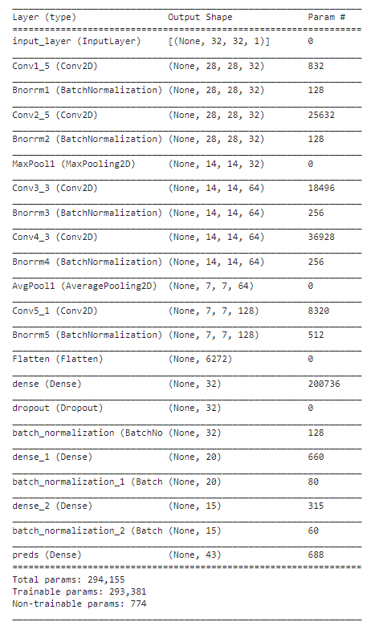
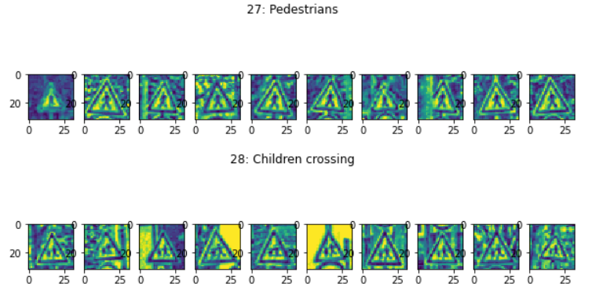

# Traffic Signs Recognition
This code is an image detection task and the purpose is to detect traffic signs from the pictures we have. Detecting traffic signs is a capability that can be seen in Tesla cars. 
Keras, Matplotlib, Seaborn, Skimage libraries are used.  
Below is the model I have performed after image normalization, converting RGB to Grayscale, and increasing the contrast of the given data. 

  

 
Using this model, I have reached an accuracy of 96%. 
The two common image classes that were mistaken for each other are shown below.    

  

